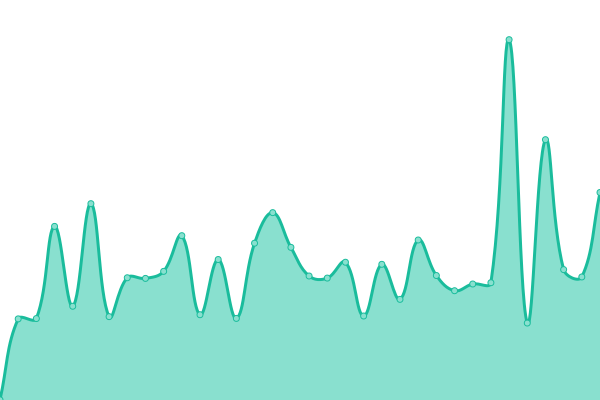

# [📈 Live Status](https://status.kevenaar.name): <!--live status--> **🟩 All systems operational**

This repository contains the open-source uptime monitor and status page for [Maurice Kevenaar](https://kevenaar.name), powered by [Upptime](https://github.com/upptime/upptime).

With [Upptime](https://upptime.js.org), you can get your own unlimited and free uptime monitor and status page, powered entirely by a GitHub repository. We use [Issues](https://github.com/mkevenaar/status.kevenaar.name/issues) as incident reports, [Actions](https://github.com/mkevenaar/status.kevenaar.name/actions) as uptime monitors, and [Pages](https://status.kevenaar.name) for the status page.

<!--start: status pages-->
<!-- This summary is generated by Upptime (https://github.com/upptime/upptime) -->
<!-- Do not edit this manually, your changes will be overwritten -->
<!-- prettier-ignore -->
| URL | Status | History | Response Time | Uptime |
| --- | ------ | ------- | ------------- | ------ |
|  [Maurice Kevenaar's Techblog](https://kevenaar.name) | 🟩 Up | [maurice-kevenaar-s-techblog.yml](https://github.com/mkevenaar/status.kevenaar.name/commits/HEAD/history/maurice-kevenaar-s-techblog.yml) | 

 804ms
     
 | 

<a href="https://status.kevenaar.name/history/maurice-kevenaar-s-techblog">100.00%</a>
    

|  [FarmPi Documentation](https://farmpi.kevenaar.name) | 🟩 Up | [farm-pi-documentation.yml](https://github.com/mkevenaar/status.kevenaar.name/commits/HEAD/history/farm-pi-documentation.yml) | 

 337ms
     
 | 

<a href="https://status.kevenaar.name/history/farm-pi-documentation">100.00%</a>
    

|  [FarmPi Mirror](https://farmpi.octofarm.net/) | 🟩 Up | [farm-pi-mirror.yml](https://github.com/mkevenaar/status.kevenaar.name/commits/HEAD/history/farm-pi-mirror.yml) | 

 572ms
     
 | 

<a href="https://status.kevenaar.name/history/farm-pi-mirror">100.00%</a>
    

<!--end: status pages-->

[**Visit our status website →**](https://status.kevenaar.name)

## 📄 License

- Powered by: [Upptime](https://github.com/upptime/upptime)
- Code: [MIT](./LICENSE) © [Maurice Kevenaar](https://kevenaar.name)
- Data in the `./history` directory: [Open Database License](https://opendatacommons.org/licenses/odbl/1-0/)
